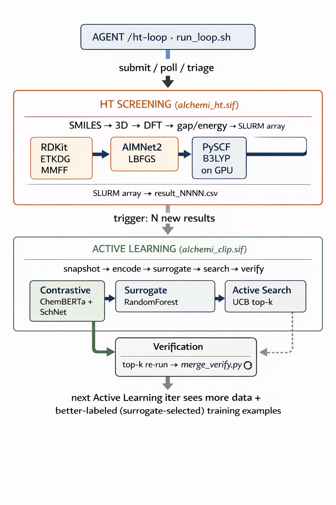

# ALCHEMI — GPU-accelerated molecular screening on FASRC



An end-to-end stack for discovering organic electrolyte candidates from large chemical libraries (GDB-17, ~10^6–10^9 molecules). Three layers:

1. **Base container** (`container/`, `examples/`) — NVIDIA ALCHEMI Toolkit + PyTorch, packaged as a Singularity image.
2. **HT screening pipeline** (`alchemi_ht/`) — SMILES → 3D embed (RDKit) → AIMNet2 relaxation → HOMO/LUMO gap (GPU4PySCF DFT). Runs as a SLURM array over chunked CSVs.
3. **Active-learning loop** (`alchemi-clip/`) — MolecularCLIP contrastive encoder + RandomForest surrogate, snapshot-driven active search over the unexplored library, top-k candidates verified back through the HT pipeline.

A Python orchestrator (`orchestrator/`, driven by the `/ht-loop` slash command) ties the two pipelines together: HT screen runs as a continuous stream, AL iterations fire on a threshold trigger without blocking the screen.

For layout, environment variables, known issues, troubleshooting, and deeper internals, see [`docs/details.md`](docs/details.md).

## Prerequisites

- FASRC cluster access with `kempner_dev` partition/account
- GPU node (tested on NVIDIA H200)
- Singularity / Apptainer CE 4.4+ at `/usr/bin/singularity`
- Python 3.12 on the submit node for the orchestrator (`module load python/3.12.11-fasrc01` or use `/usr/bin/python3.12`)

## Build

Build the base container (one-time, ~10–15 min):

```bash
cd container
sbatch build.sh                          # or: singularity build --fakeroot alchemi.sif alchemi.def
```

Build the HT container on top:

```bash
cd ../alchemi_ht
apptainer build alchemi_ht.sif alchemi_ht.def
```

Build the AL container (optional, only for research mode):

```bash
cd ../alchemi-clip
bash build.sh
```

## Run the orchestrator

Screen mode (HT pipeline only):

```bash
# Prep: convert + shuffle + chunk (one-time)
python3.12 alchemi_ht/convert_smi_to_csv.py \
    alchemi_ht/GDB17.50000000LL.smi.gz alchemi_ht/gdb17_subset.csv \
    --shuffle-seed 42
python3.12 alchemi_ht/chunk_data.py \
    --input-csv alchemi_ht/gdb17_subset.csv \
    --output-dir runs/screen/chunks

# Seed the AIMNet2 model cache (compute nodes lack outbound HTTPS)
bash container/fetch_aimnet_assets.sh

# Orchestrator
python3.12 -m orchestrator.ht_loop --mode screen --action init --shuffle-seed 42
python3.12 -m orchestrator.ht_loop --mode screen --action tick
python3.12 -m orchestrator.ht_loop --mode screen --action status
```

Research mode (HT + AL concurrently):

```bash
python3.12 -m orchestrator.ht_loop --mode research --action init --trigger-threshold 100
python3.12 -m orchestrator.ht_loop --mode research --action tick
python3.12 -m orchestrator.ht_loop --mode research --action status
```

Automated ticking (tmux-based, unattended):

```bash
bash orchestrator/run_loop.sh start      # create session 'alchemi-loop'
bash orchestrator/run_loop.sh attach     # view live (Ctrl-b d to detach)
bash orchestrator/run_loop.sh status
bash orchestrator/run_loop.sh stop
```

See [`docs/details.md`](docs/details.md) for the agent-driven driver, the `/ht-loop` slash command, AL phase transitions, and state-file locations.

## References

- [`docs/details.md`](docs/details.md) — full details, environment, known issues, troubleshooting.
- [`alchemi_ht/README.md`](alchemi_ht/README.md) — HT pipeline internals.
- [`alchemi-clip/README.md`](alchemi-clip/README.md) — AL encoders and surrogate.
- [`ARCHITECTURE.md`](ARCHITECTURE.md) — top-level design decisions.
